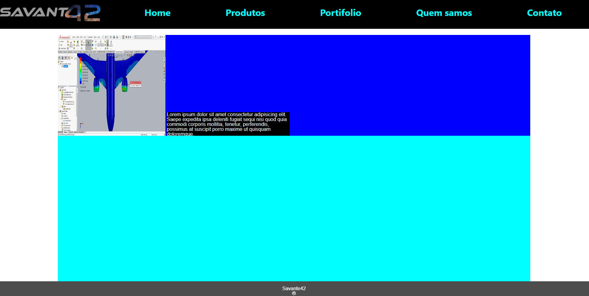

# Projeto E-commerce Savante 42

## Tecnologias Utilizadas

<div style="display: inline_block">
    
    
    
    
    
    
    
    

</div>
<br>

#


## Licença vinculada ao repositório
[](https://github.com/LuizFernandoDeveloper/savante42-E.commerce/blob/main/LICENSE)

#

 <h2> Esse é um projeto de um e-commerce que vendera produtos relacionados a aquaponia </h2><br>

  - Estamos a desenvolver a pagina Home, no momento enfrento dificuldate de achar um design ideal. Não Pensei ainda nas Outras paginas. <br> (Todo o projeto está sendo desenvolvido do zero ate mesmo a arte do projeto. Estou fazendo a arte no Illustrator e outros software adobe)
   
   
  
### Ajustes e melhorias

O projeto ainda está em desenvolvimento e as próximas atualizações serão voltadas nas seguintes tarefas:

- [ ] Melhoria no desing da pagina home
- [ ] Melhoria no desing da pagina contatos
- [ ] Adiciona pagina para login 
- [ ] Testar o frontend
- [ ] Iniciar o Backend

#


Antes de começar, verifique se você atendeu aos seguintes requisitos:

* Você deve instalar `<Java 11+ / STS / node / Angular cli / vscode >`.
* Sistema operacional compatível: `<Windows / Linux / Mac>`.


## 🚀 Clone savante 42

Para Clonar o e-commerce-VerdeUrbano, siga estas etapas:

Linux e macOS:
```
git clone https://github.com/LuizFernandoDeveloper/savante42-E.commerce.git
```

Windows:
```
git clone https://github.com/LuizFernandoDeveloper/savante42-E.commerce.git
```


## 📫 Contribuindo para savante 42

Para contribuir com Critique seus Filmes, siga estas etapas:

1. Bifurque este repositório.
2. Crie um branch: `git checkout -b <nome_branch>`.
3. Faça suas alterações e confirme-as: `git commit -m '<mensagem_commit>'`
4. Envie para o branch original: `git push origin <nome_do_projeto> / <local>`
5. Crie a solicitação de pull.

#

## 🤝 Colaboradores

Agradecemos às seguintes pessoas que contribuíram para este projeto:

<table>
  <tr>
    <td align="center">
      <a href="#">
        <br>
        <sub>
          <b>Luiz Fernando Rodrigues</b>
        </sub>
      </a>
    </td>
   
 
</table>


#
[⬆ Voltar ao topo](https://github.com/LuizFernandoDeveloper/savante42-E.commerce/tree/main)<br>

#
